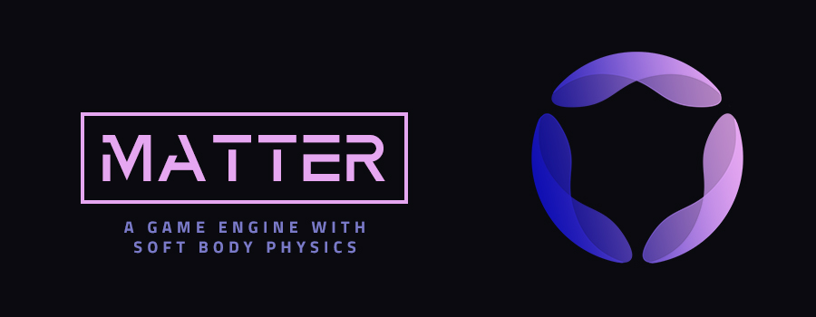
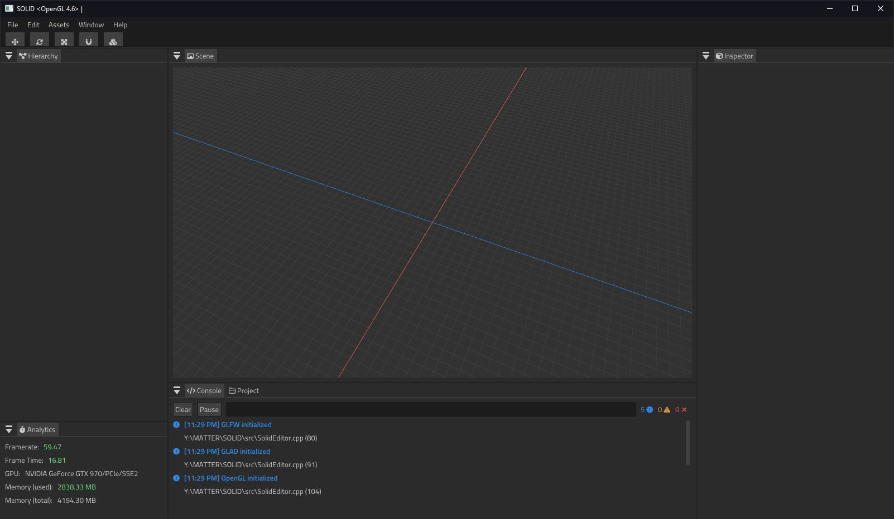

    

    
    
    
    

## Another game engine?

*There are dozens of great and feature-complete game engines already available on the market today, why develop another one? Is MATTER trying to compete with those?*

Simply put, **no**. MATTER is a personal learning project being developed as a vessel for better understanding computer graphics and the physics involved in 3D game engines. I like making games, and I like programming. But more than those two things, I love challenges.

## Documentation

Documentation is sparse and incomplete, but is being continuously updated. You can find it [here](https://jakerieger.github.io/MATTER).

## Build Status

MATTER is targetting Windows **only** at the moment. Support for Unix/macOS may come in the future but is not being prioritized as OpenGL support is poor at best. Therefore, the following table is referring to the specificed compilers running on Windows 10.

|Compiler|Arch|Status|
|--------|----|------|
|MSVC 17 |x64 ||
|MSVC 15 |x64 ||
|GCC |x64 ||
|Clang | - ||

## Resources

This is a list of resources I've found helpful while developing MATTER.

- [LearnOpenGL.com](https://learnopengl.com/) - A brilliant collection of step-by-step tutorials on working with OpenGL and 3D graphics from scratch.
- [3D Rigid Body Physics Simulation](https://jonathanbosson.github.io/reports/TNM085_group5.pdf) - An excellent paper by Olle Grahn, Marcus Lilja, Jonathan Bosson, and Torsten Gustafsson on the mathematics behind simulating 3D rigidbodies.
- [Unity C# Reference](https://github.com/Unity-Technologies/UnityCsReference) - The public repository for the Unity engine's managed codebase.
- [Official Blender Mirror](https://github.com/blender/blender) - Source code for the Blender 3D modelling software
- [But How DO Soft Body Simulations Work?](https://www.youtube.com/watch?v=kyQP4t_wOGI) - An excellent and concise overview of softbody physics simulations in practice
- [Designing a Physics Engine in 5 minutes](https://www.youtube.com/watch?v=-_IspRG548E) - A high level overview of the implementation of a basic 3D rigidbody physics engine
- [Ray Marching](https://michaelwalczyk.com/blog-ray-marching.html) - An overview of the Ray Marching alrgoithm and how it can be implemented in shaders
- [BeamNG.drive Docs](https://documentation.beamng.com/) - Some nice documentation on the inner-workings of the BeamNG softbody physics engine

## Third Party Libraries

MATTER uses several third party libraries. License information can be found here: [Third Party Licenses](/EXTERNAL/licenses/).

## License

MATTER is licensed under the [ISC license](LICENSE). All third party sources are licensed under their respective licenses detailed [here](/EXTERNAL/licenses/).